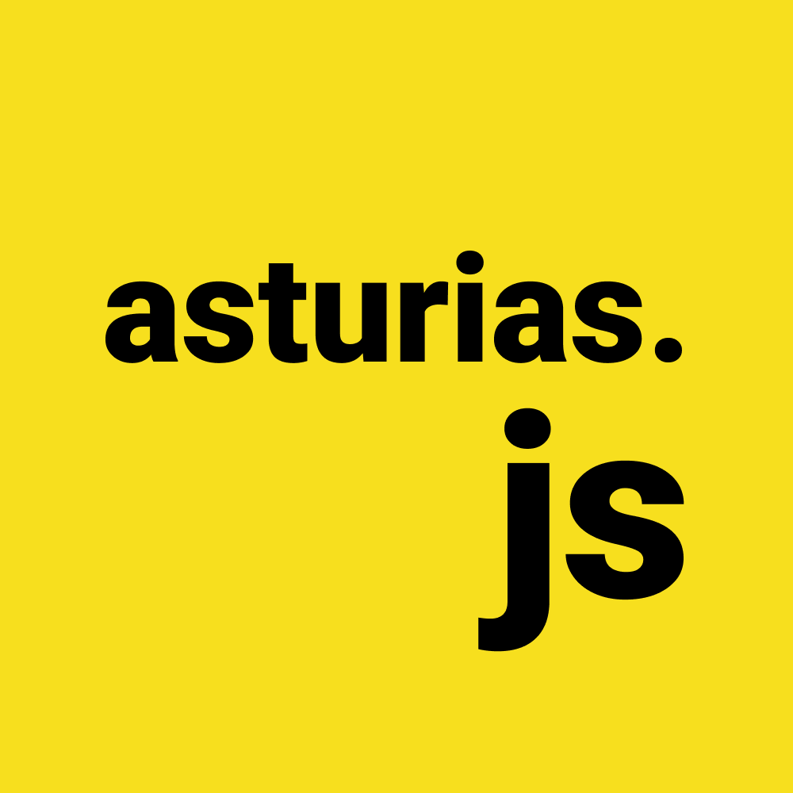

# Activities

¿Quieres proponer una charla, taller, hackathon, debate, etc? [Abre una issue](https://github.com/asturiasjs/activities/issues/new/choose) y cuéntanos tu propuesta ✨

## Sobre asturias.js

Grupo para entusiastas de JavaScript (en todas sus variantes y contextos) que quieran juntarse mensualmente para compartir experiencia y conocimiento. Organizaremos charlas, talleres y crearemos un espacio seguro donde pasar un rato divertido.

No es necesaria experiencia previa con el lenguaje, nuestra misión es generar un punto de encuentro para aprender en comunidad.

## Atribución

Este repositorio de gestión de actividades es una adaptación de [AsturiasHacking/activities](https://github.com/asturiashacking/activities).
